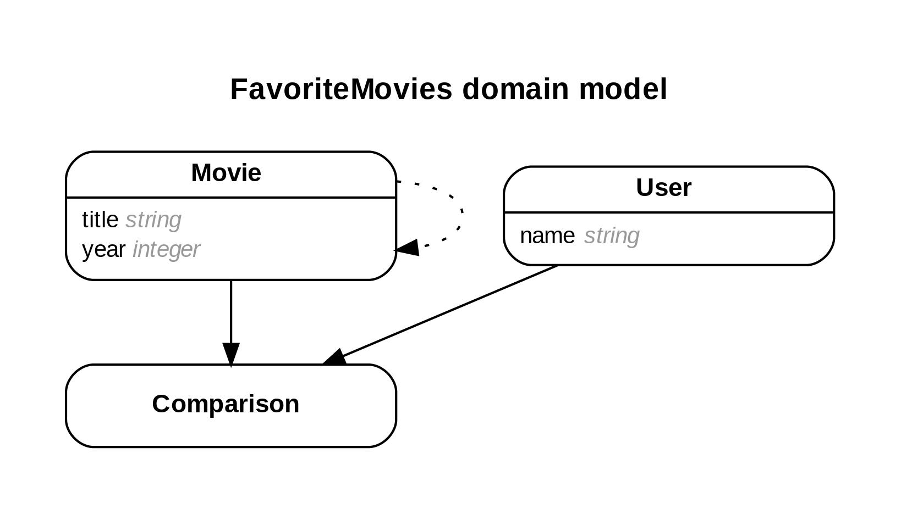

# README
## Favorite movies

I had tried to understand how to build teh triple join table here.

* Ruby version - `2.7.2`
- Rails version - `6.1.4.1`
- Postgres: >=9.5

- Run this App
- Clone this repository to your local: `git@github.com:Laguna1/Favorite-movies.git`
- From your terminal:
navigate inside the repository through your terminal `cd Favorite-movies`
run `bundle install` for install gem dependencies
 - Create the database `rails db:create`
 - Migrate tables into your database `rails db:migrate`
 - Seed the database `rails db:seed`
 - Start a Rails server `rails s`
In your browser, type into your url `http://localhost:3000/users`
or `http://localhost:3000/movies`

### Author

👤 **Oksana Petrova**

- GitHub: [@github/Laguna1](https://github.com/Laguna1)
- Linkedin: [linkedin/OksanaPetrova](https://www.linkedin.com/in/oksana-petrova/)
- Twitter: [@OksanaP48303303](https://twitter.com/OksanaP48303303)

## 🤝 Contributing

Contributions, issues and feature requests are welcome!

Feel free to check the [issues page](https://github.com/Laguna1/Favorite-movies/issues).

## Show your support

Give a ⭐️ if you like this project!